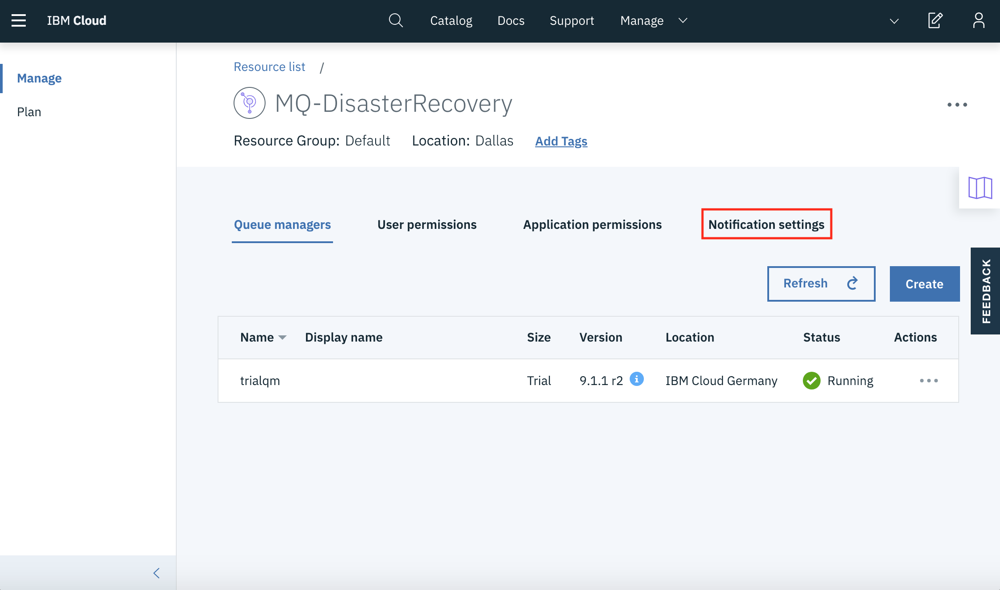
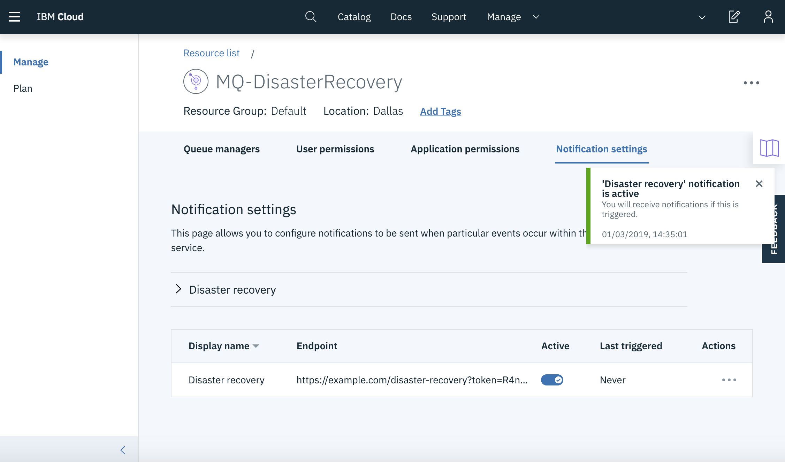
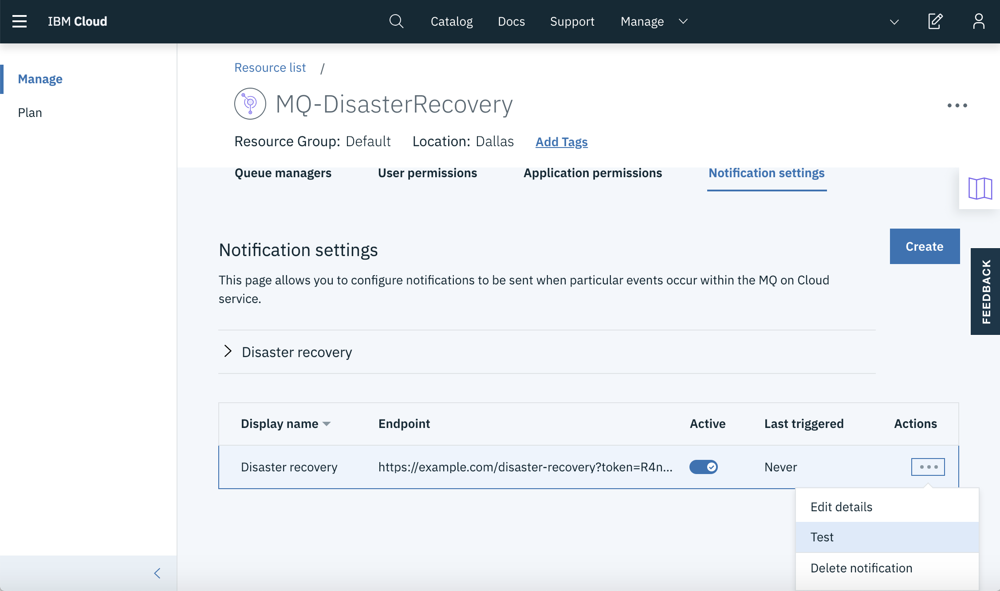
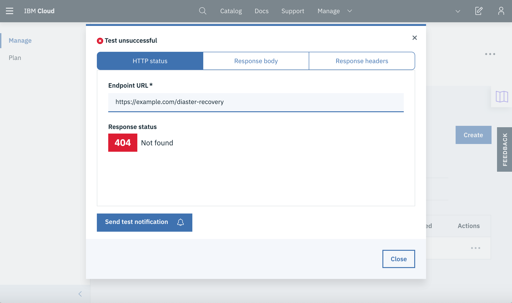
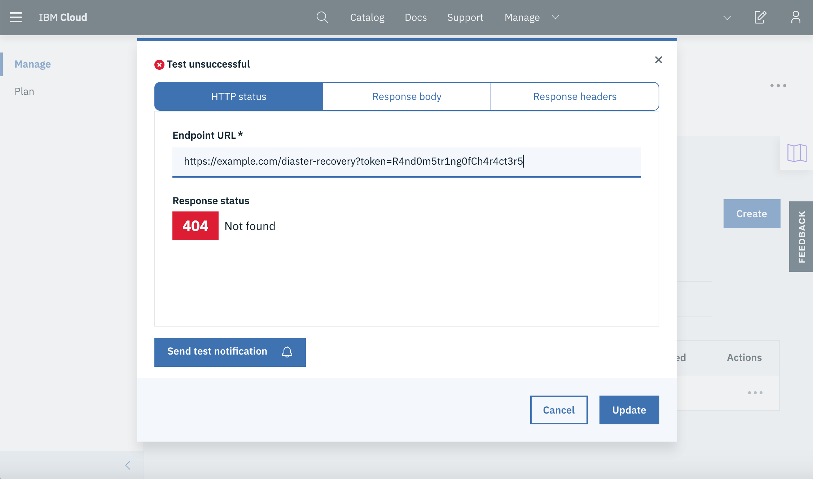

---
copyright:
  years: 2019
lastupdated: "2019-02-13"
---

{:new_window: target="_blank"}
{:shortdesc: .shortdesc}
{:screen: .screen}
{:codeblock: .codeblock}
{:pre: .pre}

# Disaster Recovery Notifications
{: #mqoc_problem_intro}

This document contains information about the disaster recovery (DR) process for the MQ on Cloud service. In the event of a catastrophic failure of a hosting facility, the IBM Operations is responsible for recovering deployed queue managers to an alternate location using a recent configuration backup. The following sections describe how you can configure a callback to be notified when that recovery process has been completed by the IBM Operations team. This is so you can carry out any subsequent actions required to return the restored queue manager to normal operation.

You will be guided through the process of setting up DR notifications and configuring your endpoint handler to receive the notifications. You may use your own endpoint handler; however there is a working example in the final section of this document.

The cold restore of the queue manager from a configuration backup does not retain runtime state, such as message data and channel sequence numbers. Therefore when you receive the notification event from IBM, you may need to take further action. For example, resetting channel sequence numbers to re-establish communication with other queue managers, or validating application behaviour in light of the potential for persistent messages to have been lost.

{:shortdesc}

The following sections will be covered in this document:

* [How to configure notification calls](#mqoc_dr_notify)
* [The payload](#mqoc_dr_payload)
* [How to implement an endpoint handler](#mqoc_dr_handler)

---

## How to configure notification calls
{: #mqoc_dr_notify}

* Within the IBM Cloud console for the service instance in which your queue managers are deployed, navigate to your service instance and select the queue manager you wish to configure DR notification calls for.

* Click the tab titled 'Notification settings'.

  

* Click 'Create' to begin setting up your notification.

* Choose a display name for your notification and insert the endpoint url that you wish to receive the notifications calls.

  **Note**: this *must* be a secure url (HTTPS).

  

* To prevent malicious users from triggering your DR endpoint (i.e. invoking the url you have chosen to receive your notifications), it is recommended you use a query parameter in your url, which can be checked by the handler when invoked.

  For example:

      https://example.com/disaster-recovery?token=R4nd0m5tr1ng0fCh4r4ct3r5

  When TLS is implemented during the connection (using HTTPS) the entire url, including the query parameter, is encrypted as it flows over the network, so the query parameter cannot be seen by a malicious user observing network traffic

* Click 'Create' to finish configuring your DR notification.

* To enable these notifications, ensure the 'Active' toggle switch is on.

  

---

* To test your notification configuration, under 'Actions', select the ellipsis (...) and click 'Test'.

  

* In order to send a test to your endpoint, click 'Send test notification'.

* If you receive a response status of **200** in the testing tool, your notification was successfully delivered to you endpoint. You can see the body and header to check the endpoint's response.

  

* If you receive a failure response, your test was not successful. The response body and response header tabs should be examined to identify the problem.

  

* If you have chosen to use a query parameter, ensure this is included in the endpoint url.

  

You have now configured MQ on Cloud to send disaster recovery notifications to your endpoint.

---

## The payload
{: #mqoc_dr_payload}

The following JSON is an example of the payload you will receive when a DR notification is sent:

    {
        "datestamp": "1970-01-01T00:00:01.979587374Z",
        "description": "Queue managers in the location shown below have been recreated from a configuration backup.",
        "moreInformation": "https://example.com",
        "queueManagerLocation": "qm.us-south.mq.appdomain.cloud",
        "queueManagers": [{
          "hostname": "qm1-abcd.qm.us-south.mq.appdomain.cloud",
          "name": "QM1"
          }, {
          "hostname": "qm2-abcd.qm.us-south.mq.appdomain.cloud",
          "name": "QM2"
        }],
        "region": "us-south",
        "serviceInstance": "crn:v1:staging:public:mqcloud:region:a/ab90cde12f345:ab5c678d-e90a-b5678c9::"
    }

The notification will contain the following keys:

* **datestamp:** the date and time the notification was sent
* **description:** an explanation of the problem and what action was taken
* **moreInformation:** this may contain an external link to further explain the cause behind the DR
* **queueManagerLocation:** the location of the cluster on which the queue manager is deployed
* **queueManagers:** a list of hostnames and names of all affected queue managers
* **region:** the physical location of your service instance
* **serviceInstance:** the unique CRN of the containing service instance

---

## How to implement the endpoint handler
{: #mqoc_dr_handler}

The instructions below demonstrate some sample code to implement an endpoint handler to send notifications via PagerDuty in an IBM Cloud Function, but you could also adapt this code to run in a location of your choice

**Note:** the below function is written in Node.js

    const https = require('https');

    function main(params) {

      return new Promise((resolve, reject) => {

        // Replace the string "R4nd0m5tr1ng0fCh4r4ct3r5" with your own value to secure access to your own specific endpoint
        // An example to implement the query parameter '?token=R4nd0m5tr1ng0fCh4r4ct3r5'
        if (params.token !== "R4nd0m5tr1ng0fCh4r4ct3r5") {
            process.exit();
        }

        const pdparams = {
          "service_key": "<PagerDuty service key>",
          "description": params.description,
          "event_type": "trigger"
        }

        const options = {
          hostname: 'events.pagerduty.com',
          port: 443,
          path: '/generic/2010-04-15/create_event.json',
          method: 'POST'
        }

        const req = https.request(options, (resp) => {
          let data = '';
          resp.on('data', (chunk) => {
            data += chunk;
          });

          resp.on('end', () => {
            const info = JSON.parse(data);
            console.log(info);
            params.info = info;
            resolve(params);
          });

        }).on("error", (err) => {
          console.log(err);
          reject({
            statusCode: 500,
            headers: {'Content-type': 'application/json'},
            body: {message: 'Problem calling pagerduty', error: err}
          });

        });

        req.write(JSON.stringify(pdparams));
        req.end();

      });

    }

  * [Click here](https://cloud.ibm.com/openwhisk/create/action) to create an action in IBM Cloud Functions.

  * Give your action a name and select your choice of language. For the example above, *Node.js 10* was selected.

  * Click 'Create' and insert the example code, ensuring the appropriate fields are changed.

  * Under 'Endpoints', tick the box next to 'Enable as Web Action'.

  * Use the given url ending in *.json* as your endpoint url for your DR notification, ensuring the query parameter is inserted on the end.

---
